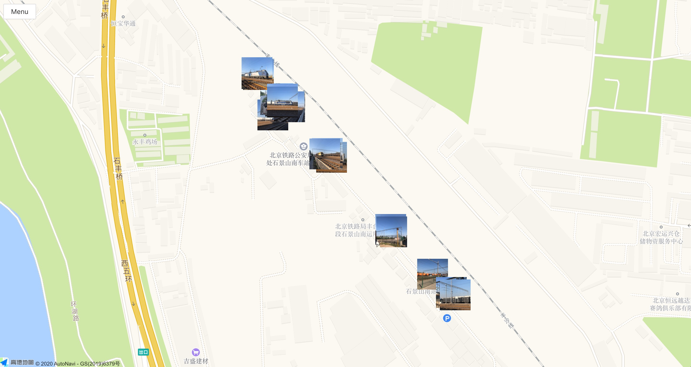
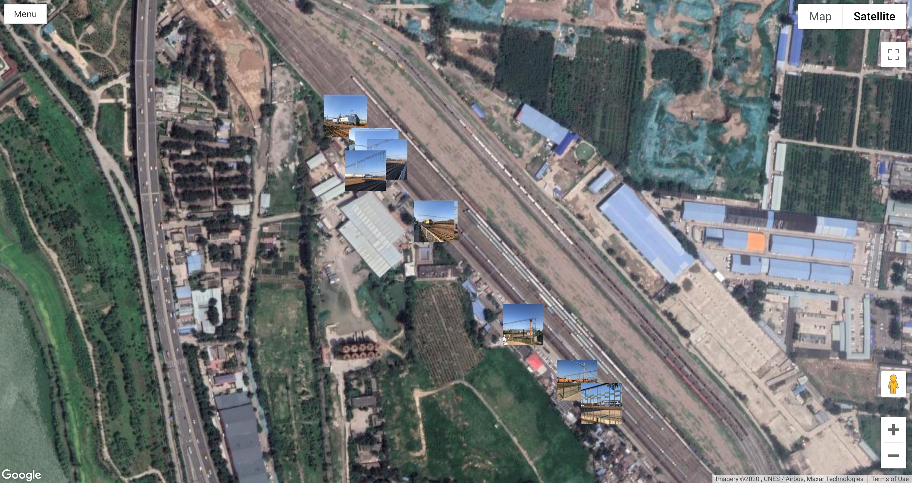

# photo-map.github.io [](https://github.com/photo-map/photo-map.github.io/actions/workflows/build-deploy.yml) [](https://codecov.io/gh/photo-map/photo-map.github.io) [](https://snyk.io/test/github/photo-map/photo-map.github.io)

## Summary

Show your photos on the Google Maps or AMap. Please try it on this website: [https://photo-map.github.io](https://photo-map.github.io)

- Load photos from Google Drive public folder
- Load photos from Google Drive private folder (need login from Google)

## Snapshots

Photos on the AMap



Photos on the Google Maps



## Develop

Generate `.env.local` with content:

```
REACT_APP_GOOGLE_MAPS_API_KEY=AIz***kC8
REACT_APP_AMAP_API_KEY=ef0***63e
REACT_APP_BAIDU_MAP_AK=72y***QFK
```

Run dev server.

```sh
$ npm i
$ npm start
```
