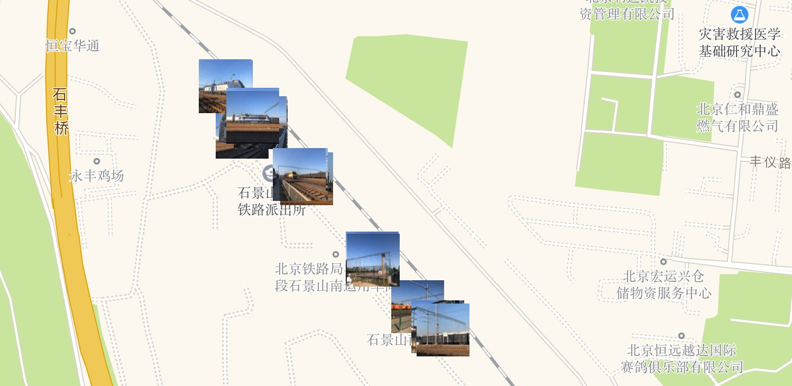

# photo-map.github.io [](https://travis-ci.org/photo-map/photo-map.github.io)

## Website

[https://photo-map.github.io](https://photo-map.github.io)



## Develop

```
$ yarn
```

Generate `.env`

```
REACT_APP_GOOGLE_MAPS_API_KEY=AIz***kC8
REACT_APP_AMAP_API_KEY=ef0***63e
```

## Init

```
$ yarn add react-google-maps
$ yarn add recompose
$ yarn add react-amap
```
