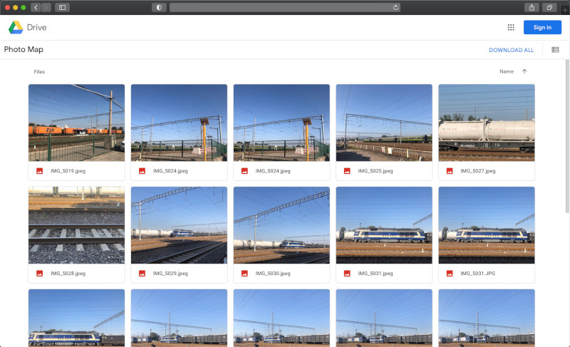

# How to use

## Step 1: Prepare some photos with EXIF GPS coordinate data.

How can I tell there is EXIF data in one photo? => [https://www.howtogeek.com/211427/how-to-see-exactly-where-a-photo-was-taken-and-keep-your-location-private/](https://www.howtogeek.com/211427/how-to-see-exactly-where-a-photo-was-taken-and-keep-your-location-private/)

## Step 2: Upload these photos to Google Drive, put in "Photo Map" folder.

## Step 3: Access [https://photo-map.github.io/](https://photo-map.github.io/) website, and sign in Google.
